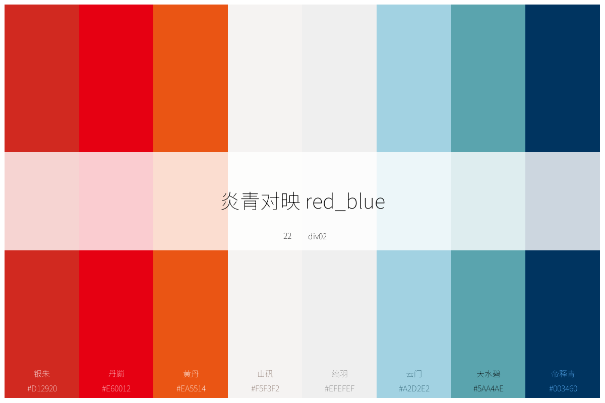

<!-- README.md is generated from README.Rmd. Please edit that file -->

```{r, include = FALSE}
knitr::opts_chunk$set(
  collapse = TRUE,
  comment = "#>",
  fig.path = "figures/README-",
  out.width = "100%"
)
library(showtext)
showtext_auto()
font_add("simkai",regular = "C:\\Windows\\Fonts\\simkai.ttf")
devtools::load_all()
```

# chinacolor

<!-- badges: start -->

<!-- badges: end -->

这个包受中文书籍[《中国传统色：故宫里的色彩美学》](https://baike.baidu.com/item/%E4%B8%AD%E5%9B%BD%E4%BC%A0%E7%BB%9F%E8%89%B2%EF%BC%9A%E6%95%85%E5%AE%AB%E9%87%8C%E7%9A%84%E8%89%B2%E5%BD%A9%E7%BE%8E%E5%AD%A6/56817070)的启发而制作，将该书提及到的384种颜色关键信息整理成颜色数据信息，基于这些数据：

-   内置了顺序型、发散性和定性型调色板各20个；

-   内置了5款基于中国传统文化特色的适配ggplot的绘图主题；

-   形成了浏览、打印这些颜色和调色板的函数，供用户快速获取颜色信息；

-   形成了利用这些颜色或内置调色板定制调色板的工具；

-   形成了适配ggplot绘图的scales系列函数。

一千个人眼中有一千个哈姆雷特。384种颜色，更能绘制出万千精彩。这里不想赘述中华传统色出彩的视觉感受和入化的神韵和内涵。毕竟，美，往往是不可言，也无需多言的。

期望这个包能帮助到大家，促发灵感、增进兴趣。或者，让大家的交付和世界，稍微更优美一些...

## {width="708"}


## Installation

You can install the development version of `chinacolor` like so:

```{r eval=FALSE, include=TRUE}
 # 用 devtools 安装
devtools::install_github("zhiming-chen/chinacolor")

# 或用 remotes 安装（语法相同）
remotes::install_github("zhiming-chen/chinacolor")
```

## 颜色:打印、预览与获取

### plot_color_grid 打印全部颜色

384种颜色，按中国24个节气排列。每个节气分四组，每组4个颜色共16个颜色。下图供大家预览这384种颜色：


也可以执行`plot_color_grid` 函数查看,设置`show_group`参数可以控制是否显示颜色分组。

```{r eval=FALSE, include=TRUE}
plot_color_grid(show_group = T)
```

目前，尚无函数来支持打印按季节显示颜色的图形，不过，我们可以在XXXXXX(github 仓库地址)查看全部24个节气的颜色系列。这些图形中包含丰富的颜色信息，包括颜色id(这些id 在本包中方便我们设计调色板时取色)，RGB值，CMYK值，当然，也有HEX值。每个颜色有一个中文名，对于熟悉中文或者对中文感兴趣的人，这也是一种不错的体验。

### list_colors 快速预览颜色

很多时候，我们需要即时、动态、快速预览并获得颜色，`list_colors`函数，我觉得是一个非常amazing的函数，能帮助我们在Rstudio 中Viewer界面快速预览颜色，并即时获得颜色hex值，总之，我已经非常迷恋这个函数，甚至有点离不开他了。

```{r eval=TRUE, include=TRUE}
list_colors()
```

是的，你只需在console 里键入`list_colors()`,在Viewer界面就能显示颜色，默认16行一页...

忍不住多说几句，这个功能在我们设计调色板，或者绘图时调整颜色时真的非常有帮助。

## 调色板：打印、预览、获取与定制

现在，我们对这384种颜色已经有一定了解了，不得不说，这些颜色，那是相当的amazing。如我们所见，这些颜色分组，本身已经是一种调色板的设置，至少是形成了一些我们可用的初始形态了。60组调色板被预置于本包中，供使用本包时调用，后续也许还会更新一些有趣的调色板。当然，你也可以基于这些颜色设计属于自己的调色板。

关于调色板的打印、预览、获取与定制，下面这些函数被设计用来尽可能的方便大家。

我们可以先感受一下这些调色板：





内置的调色板被定义为三种类型，顺序型，发散型和定性型。每种20个。

这些调色板被id化以及规则命名化：

-   顺序型调色板：

    -   id：1-20

    -   命名：seq01-seq20。

-   发散型调色板：

    -   id：21-40

    -   命名：div01-div20。

-   定性型调色板：

    -   id：41-60

    -   命名：qual01-qual20。

当然，每个调色板也有其中文名称与英文名称，通过输入对应名称，可获取单个调色板信息。

### list_palettes 预览调色板

和预览原色一样，调色板也是可以在Viewer界面进行预览的，这能解决我们对调色板中文名或英文名不熟悉的问题(我在使用其他一些经典的配色包时，经常碰到这样的问题，记住名字对我来讲通常是很困难的事情),也能第一时间预览到调色板颜色状态，这对在scale 系列函数中使用调色板，以及通过`ctc_palette`函数自定义调色板都是很有帮助的。

`list_palettes()` 函数轻松解决这一问题。

```{r echo=TRUE}

list_palettes()

```

我们还可以通过这个函数将这些内置调色板信息导出。

```{r}
palettes_info <- list_palettes()

palettes_info
```

### plot_palettes 打印多个调色板

`plot_palettes` 函数支持将多个调色板打印在一张图上，支持index和元素名称输入。

```{r}
# input index
plot_palettes(1:5)

# input element names
plot_palettes(c("seq01","div02","qual14","qual18"))
```

他能帮助我们将多个调色板颜色信息置于一处以便选择比较。


### plot_palette 打印单个调色板

当我们想查看单个调色板细节时，`plot_palette` 函数就能派上用场。

这个函数打印内置的调色板，也支持打印自定义的调色板。默认模式为内置调色板。

当打印内置调色板时，支持index，elementname,以及调色板的中英文名称作为输入。同时也支持显示颜色hex值和名称等功能，对于调色板名称需要自定义，如在绘制图形时，需要备注不同调色板用于不同产品或者客户时，可以通过名称来进行备注。

+ 打印内置调色板


```{r}
# input index
plot_palette(x = 43,show_text = T)
```


```{r}
# input elementname, no color text show,and defined palette name 

plot_palette(x = "div13",name = "ONLY FOR PROJECT A!!!")

```

```{r}
# palette_name in Chinese or English 

plot_palette(x = "scarlet_flow",show_text = T)
```


```{r}
plot_palette(x = "绯绿相生",show_text = T)
```

对于内置调色板，打印图形中间条形块内显示了关于调色板的四个信息，以帮助大家进行快速记忆与选择。底部可现实颜色hex值及其中文名称。出于显示效果考虑，函数将该参数设置为非默认显示。

+ 打印自定义调色板

对于自定义调色板，输入可以是颜色向量或向量对象名称。该功能更多的是为自定义调色板时调色板的显示而生。这里简单示例。

对于自定义调色板,关于名称显示，如输入了名称，以输入的名称为准。如未输入名称，当输入为颜色向量时，调色板名称显示为`unnamed palette`，当输入为颜色向量对象名时，调色板名称显示为向量名。

对于来自384种内置的颜色，其中文名是可以显示的。仅支持全部来着内置颜色的显示。

```{r}
# name provided
plot_palette(x = c("#99BCAC","#5F4321","#BA5140","#DD7694","#779649"),type = "custom",name = "Just for Test",show_text = T)
# no name provided and show_text in default status
plot_palette(x = c("#99BCAC","#5F4321","#BA5140","#DD7694","#779649"),type = "custom")
```


```{r}
# 输入向量名

test_pal <- c("#C67915","#2C2F3B","#9A6655","#A72126","#446A37","#5B3222")
plot_palette(x = test_pal,type = "custom",show_text = T)

```

这两个调色板看起来不错，值得收藏起来。


### ctc_palette 定制调色板

`ctc_palette` 函数用于定制调色板，并被scale_fill(color)_ctc_*  系列函数调用。

ctc为Chinese Traditional Colors 三个单词的首字母组合。他能实现：

+ 从内置的调色板里获取颜色信息，并执行颜色数量，方向等基础编辑；

+ 也支持从内置的384种颜色中，按id,group,subgroup以及他们的组合拾取颜色形成自定义调色板。因为原书作者对颜色的理解非常专业，该函数使用了颜色分组和子组的选择。(我用子组对这些颜色在其所在颜色分组里进行了简单的数字定义，在原书中，每个子组均有其内在含义的，这里不展开)


#### 从内置调色板定制

```{r}

```


### create_color_pick 提取颜色高效工具，构建属于自己的调色板


### 在ggplot里使用调色板

## scales 标度系列函数，适配ggplot绘图

## theme模版，源于中国传统文化

```{r eval=FALSE, include=TRUE}

list_colors()

```

```{r cars}
summary(cars)
```

You'll still need to render `README.Rmd` regularly, to keep `README.md` up-to-date. `devtools::build_readme()` is handy for this.

You can also embed plots, for example:

```{r pressure, echo = FALSE}
plot(pressure)
```

In that case, don't forget to commit and push the resulting figure files, so they display on GitHub and CRAN.
