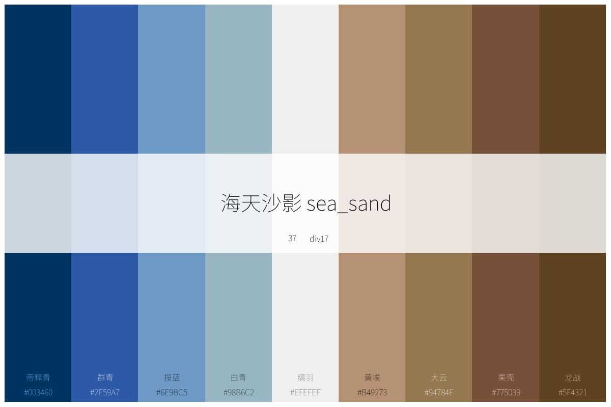
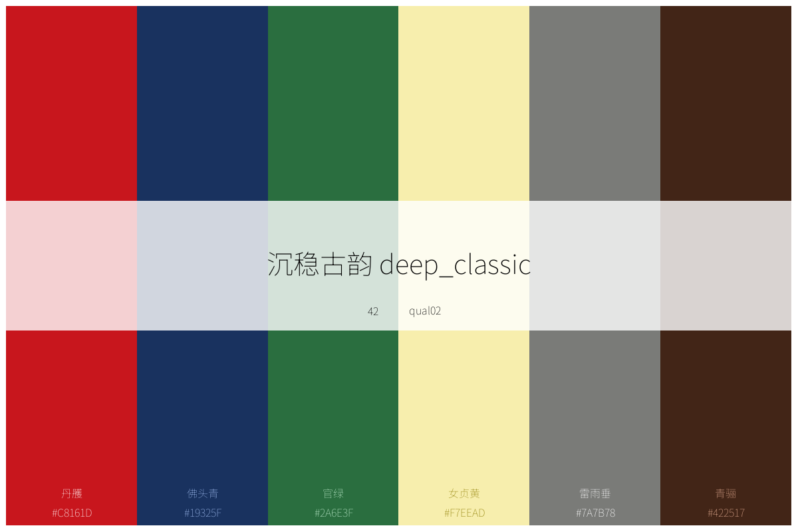
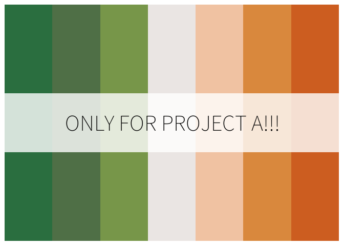
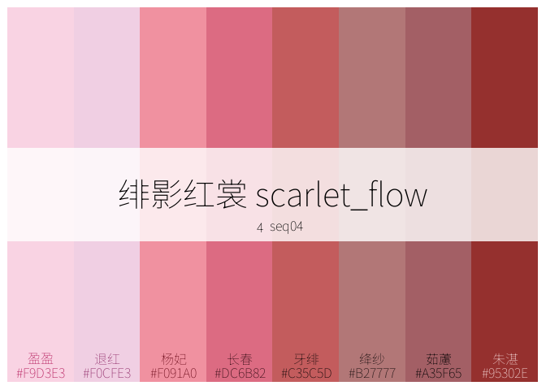
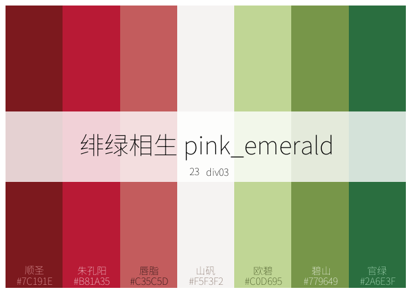
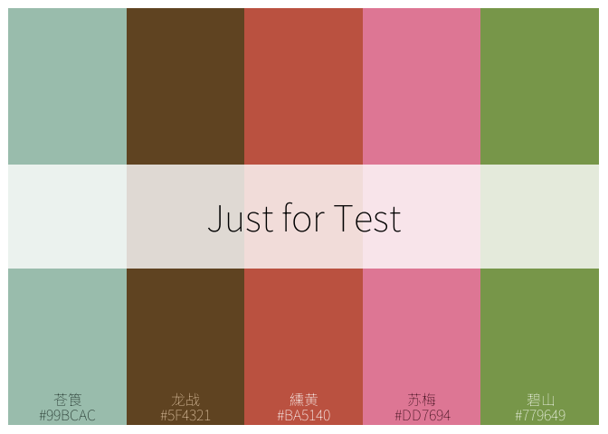
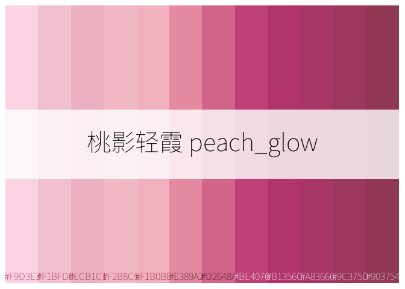
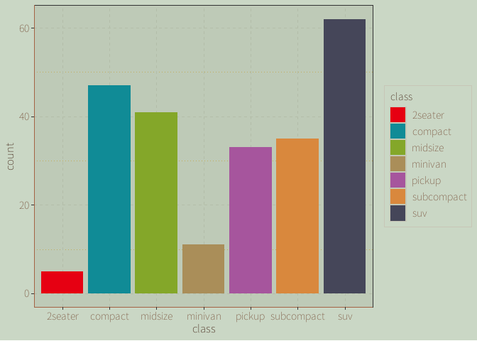

<!-- README.md is generated from README.Rmd. Please edit that file -->

| 语言 / Language | 版本 |
|-----------------|------|
| 🇺🇸 English      | [README.md](README.md) |
| 🇨🇳 中文         | [README.zh-CN.md](README.zh-CN.md) |

# chinacolor :Chinese Traditional Colors

<!-- badges: start -->
<!-- badges: end -->

Inspired by the Chinese book[Chinese Traditional Colors: The
Aesthetics of Colors in the Forbidden
City](https://baike.baidu.com/item/%E4%B8%AD%E5%9B%BD%E4%BC%A0%E7%BB%9F%E8%89%B2%EF%BC%9A%E6%95%85%E5%AE%AB%E9%87%8C%E7%9A%84%E8%89%B2%E5%BD%A9%E7%BE%8E%E5%AD%A6/56817070),
this package was developed. The key information of 384 colors from this
book has been compiled into color data, and based on this data:

- Built-in 20 Sequential, 20 Diverging, and 20 Qualitative color
  palettes respectively;

- Built-in 5 ggplot-compatible plotting themes featuring traditional
  Chinese cultural characteristics;

- Developed functions for browsing and printing these colors and color
  palettes, allowing quick access to information about colors and color
  palettes;

- Developed tools for customizing color palettes using these colors or
  built-in color palettes

- Developed a series of scales functions compatible with ggplot
  plotting.

- 384 colors fill in circle ordered by HUE with id

<figure>

<figcaption aria-hidden="true">384 colors in circle with id</figcaption>
</figure>

- 384 in grid ordered by id with group id

<figure>

<figcaption aria-hidden="true">384 colors with group id</figcaption>
</figure>

- colors for solar term, 24 solar term in a year,16 colors for a solar
  term, each color has its means.

<figure>

<figcaption aria-hidden="true">colors for solar terms</figcaption>
</figure>

- palette with color from 384 colors

<figure>

<figcaption aria-hidden="true">a palette example</figcaption>
</figure>

## Installation

You can install the package by using the following methods.

``` r
 
devtools::install_github("zhiming-chen/chinacolor")

# or
remotes::install_github("zhiming-chen/chinacolor")
```

## Plot,Preview and Get the Colors

### plot_color_grid print colors

``` r
plot_color_grid(show_group = T)
```

All the colors for 24 solar terms can found in the folder
:[colors_by_solar_term](https://github.com/zhiming-chen/chinacolor/tree/master/image/color/colors_by_solar_term)

### list_colors Preview the colors in Viewer Panel

The `list_colors` function enables quick preview of colors in the Viewer
interface of RStudio and allows instant access to color hex values. This
feature is helpful when we design color palettes or adjust colors during
plotting.

``` r
list_colors()
```

<figure>

<figcaption aria-hidden="true">screen_shot for the preview
result</figcaption>
</figure>

## Palettes:Plot,Preview,Get and Customize

60 color palettes are pre-installed in this package for use. Here are
some examples of the palettes:







The built-in color palettes are categorized into three types:
sequential, diverging, and qualitative, with 20 palettes for each type.

These color palettes are assigned IDs and named in a regularized way:

- sequential palettes：

  - id：1-20

  - name：seq01-seq20。

- diverging palettes：

  - id：21-40

  - name：div01-div20。

- qualitative palettes：

  - id：41-60

  - name：qual01-qual20。

these names are the element names for palette in the palette_list.

And，for each palette, an embedded list in the palette_list, has its
Chinese name and English,so we can get the palette information by put in
the id number(index),element name,Chinese name and English name for
palette.

### list_palettes Preview the palettes

The same method as `list_colors` function.

``` r

list_palettes()
```


You can also get the palettes main info by run this function.

``` r
palettes_info <- list_palettes()

head(palettes_info,10)
#>       Index ElementName ChineseName    EnglishName       Type Colors
#> seq01     1       seq01    樱霞晕彩   cherry_blush sequential      8
#> seq02     2       seq02    桃影轻霞     peach_glow sequential      7
#> seq03     3       seq03    紫韵花影   violet_bloom sequential      8
#> seq04     4       seq04    绯影红裳   scarlet_flow sequential      8
#> seq05     5       seq05    幽兰绀紫  mystic_purple sequential      7
#> seq06     6       seq06    曦光流金   golden_sheen sequential      5
#> seq07     7       seq07    焰霞飞舞     flame_glow sequential      6
#> seq08     8       seq08    金缕朝霞     amber_dawn sequential      8
#> seq09     9       seq09    翠微森语 forest_whisper sequential     10
#> seq10    10       seq10    琥珀流光     amber_glow sequential      7
```

### plot_palettes: Plot Multipule Palettes

Function `plot_palettes` can help us plot multiple palettes in a picture
for compare and selection.

``` r
#  input the number vector for palettes id or index 
plot_palettes(1:5)
```


``` r

# input the element name for palettes
plot_palettes(c("seq01","div02","qual14","qual18"))
```


### plot_palette: Plot a Single Palette

Function `plot_palette`works for plot either built_in palettes or custom
palettes,you can set the parameters to match you requirement to the
plot.

- plot built_in palettes

``` r
# input index number in an easy way, show_text default value is FALSE.
plot_palette(x = 43,show_text = T)
```


``` r
# input the element name,and can also named the palette title/name by your owner words

plot_palette(x = "div13",name = "ONLY FOR PROJECT A!!!")
```



``` r
# English name of the palette also can work as an input, 

plot_palette(x = "scarlet_flow",show_text = T)
```



``` r

# Chinese name is available as expected.
plot_palette(x = "绯绿相生",show_text = T)
```



- plot custom palettes

color vector or named color vector object can be as input.

Chinese name of the color can be plot only in case that all the colors
from 384 colors collection.

``` r
#  color vector input and named palette tile 
plot_palette(x = c("#99BCAC","#5F4321","#BA5140","#DD7694","#779649"),type = "custom",name = "Just for Test",show_text = T)
```



``` r

# no tilte and no color information plot
plot_palette(x = c("#99BCAC","#5F4321","#BA5140","#DD7694","#779649"),type = "custom")
```


``` r
# object name as input,and the name given to the plot title

test_pal <- c("#C67915","#2C2F3B","#9A6655","#A72126","#446A37","#5B3222")
plot_palette(x = test_pal,type = "custom",show_text = T)
```


### ctc_palette Modify and Customize Palttes

Function `ctc_palette` designed to get and modify the built_in
palettes,and pick the color from 384 colors collection to create new
palettes.

The output of the function can be the color value input for many other
plot function,also worked for scale_fill(color)\_ctc_c/d/m\` function in
this package.

#### Get and modify the built_in palettes

The same as `plot_palette` function, parameter `palette_name` accept the
index number,element name,Chinese and English name for the palettes.

parametr `n` defined the number of color in your new palette,for
qualitative palettes,It is strongly recommend the number DO NOT more
than the number of the colors in the built_in palette.

``` r
# input index number, with the color number and direction,and show_colors
ctc_palette(palette_name = 2,n = 5,direction = 1,show_colors = T)
#> Colors in the palette:
#> [1] "#F9D3E3" "#ECB0C1" "#F6BEC8" "#DD7694" "#B83570"
#> Number of colors: 5
```


    #> [1] "#F9D3E3" "#ECB0C1" "#F6BEC8" "#DD7694" "#B83570"
    # input the element name and the color number more than the one in the target palette
    ctc_palette(palette_name = "seq02",n = 12,show_colors = T) 
    #> Colors in the palette:
    #>  [1] "#F9D3E3" "#F1BFD0" "#ECB1C1" "#F2B8C5" "#F1B0BE" "#E389A2" "#D2648A"
    #>  [8] "#BE4076" "#B1356C" "#A83666" "#9C375D" "#903754"
    #> Number of colors: 12



    #>  [1] "#F9D3E3" "#F1BFD0" "#ECB1C1" "#F2B8C5" "#F1B0BE" "#E389A2" "#D2648A"
    #>  [8] "#BE4076" "#B1356C" "#A83666" "#9C375D" "#903754"

``` r
## example for diverging palettes 

ctc_palette(type = "built_in",palette_name = 22, n = 5, direction = 1,  show_colors = T)
#> Colors in the palette:
#> [1] "#E60012" "#EA5514" "#F5F3F2" "#EFEFEF" "#A2D2E2"
#> Number of colors: 5
```


    #> [1] "#E60012" "#EA5514" "#F5F3F2" "#EFEFEF" "#A2D2E2"
    ctc_palette(type = "built_in",palette_name = 22, n = 12, direction = - 1)
    #>  [1] "#003460" "#397B91" "#6DB0BC" "#9BCDDD" "#CBE1E9" "#F0EFEF" "#F3F2F1"
    #>  [8] "#F0AB8D" "#E94D13" "#E71712" "#DE0E17" "#D12920"

``` r
#  example for qualitative palettes
# Can see what happened when n value more than the numbers of colors in the palette.
ctc_palette(type = "built_in",palette_name = 44, n = 12,direction = 1,show_colors = T)
#> Colors in the palette:
#>  [1] "#C8161D" "#003460" "#B6A014" "#779649" "#A6559D" "#FEDC5E" "#94784F"
#>  [8] "#6E9BC5" "#C8161D" "#003460" "#B6A014" "#779649"
#> Number of colors: 12
```


    #>  [1] "#C8161D" "#003460" "#B6A014" "#779649" "#A6559D" "#FEDC5E" "#94784F"
    #>  [8] "#6E9BC5" "#C8161D" "#003460" "#B6A014" "#779649"

    ctc_palette(type = "built_in",palette_name = 44, n = 5,direction = 1,show_colors = T)
    #> Colors in the palette:
    #> [1] "#C8161D" "#003460" "#B6A014" "#779649" "#A6559D"
    #> Number of colors: 5


    #> [1] "#C8161D" "#003460" "#B6A014" "#779649" "#A6559D"
    ctc_palette(type = "built_in",palette_name = 44, direction = 1,show_colors = T)
    #> Colors in the palette:
    #> [1] "#C8161D" "#003460" "#B6A014" "#779649" "#A6559D" "#FEDC5E" "#94784F"
    #> [8] "#6E9BC5"
    #> Number of colors: 8


    #> [1] "#C8161D" "#003460" "#B6A014" "#779649" "#A6559D" "#FEDC5E" "#94784F"
    #> [8] "#6E9BC5"

#### Pick up colors from 384 colors to creat palettes

Under this type, parameter `palette_name`，`n` and `direction` cannot
work,and you can make a palette by input the color_pick parameter(it is
a list for color information).

As a list,it maybe hard to you to input,and function
`create_color_pick`, special for generate the list make it easy.

- generate a diverging palette with 9 colors

``` r
 
color_pick_1 <- create_color_pick(groups = c(11,13,12),
                                  subgroups = list(4:1,1,1:4),
                                  order_rule =1)
 
Palette_C <- ctc_palette(type = "custom",
            color_pick =color_pick_1,
            show_colors = T,
            palette_title = "gold_blue")
#> Colors in the palette:
#> [1] "#C67915" "#DB9B34" "#FAC03D" "#FEDC5E" "#EBEEE8" "#9AA7B1" "#6B798E"
#> [8] "#45465E" "#2C2F3B"
#> Number of colors: 9
```


``` r
Palette_C
#> [1] "#C67915" "#DB9B34" "#FAC03D" "#FEDC5E" "#EBEEE8" "#9AA7B1" "#6B798E"
#> [8] "#45465E" "#2C2F3B"
```

- generate qualitative palettes with 6 colors

``` r
color_pick_2 <- create_color_pick(groups = 10:15,
                                  subgroups = 3,
                                  order_rule =1)
color_pick_3 <- create_color_pick(groups = 10:15,
                                  subgroups = 4,
                                  order_rule =-1)

Palette_A <-  ctc_palette(type = "custom",
            color_pick =color_pick_2,
            show_colors = T,
            palette_title = "Palette A")
#> Colors in the palette:
#> [1] "#DC6B82" "#DB9B34" "#45465E" "#E0E0D0" "#B26D5D" "#C8161D"
#> Number of colors: 6
```


``` r
Palette_B <- ctc_palette(type = "custom",
            color_pick =color_pick_3,
            show_colors = T,
            palette_title = "Palette B")
#> Colors in the palette:
#> [1] "#A72126" "#9A6655" "#C7C6B6" "#2C2F3B" "#C67915" "#C35C5D"
#> Number of colors: 6
```


``` r
Palette_A 
#> [1] "#DC6B82" "#DB9B34" "#45465E" "#E0E0D0" "#B26D5D" "#C8161D"
Palette_B
#> [1] "#A72126" "#9A6655" "#C7C6B6" "#2C2F3B" "#C67915" "#C35C5D"
```

### Use the palette in ggplot

- discrete + fill

``` r
ggplot(data = iris,aes(x = Species,y = Petal.Length,fill = Species))+
    geom_violin()+
    scale_fill_manual(values = ctc_palette(palette_name = 48,n = 3))
```


- use a named color vector object

``` r
ggplot(data = iris,aes(x = Species,y = Petal.Length,fill = Species))+
    geom_violin()+
    scale_fill_manual(values = Palette_A)
```


- discrete + color

``` r
ggplot(data = iris,aes(x = Sepal.Length  ,y = Sepal.Width  ,color = Species))+
    geom_point(size = 4)+
    scale_color_manual(values = ctc_palette(palette_name = 44,n = 3))
```


- continuous + color

``` r
ggplot(data = iris,aes(x = Species,y = Sepal.Width,color = Sepal.Width))+
    geom_point(size = 4)+
    scale_color_gradientn(colours = ctc_palette(palette_name = 9))
```


- continuous + fill

``` r
 
df <- expand.grid(x = 1:20, y = 1:20)
df$z <- (df$x - 10) * (df$y - 10)   

ggplot(df, aes(x, y, fill = z)) +
  geom_tile(color = "white", size = 0.3) +   
  scale_fill_gradientn(
    colours = rev(Palette_C), # reverse the direction
    name = "Values",
  ) +
  labs(title = "Palette Test") +
  theme_minimal()
#> Warning: Using `size` aesthetic for lines was deprecated in ggplot2 3.4.0.
#> ℹ Please use `linewidth` instead.
#> This warning is displayed once every 8 hours.
#> Call `lifecycle::last_lifecycle_warnings()` to see where this warning was
#> generated.
```


## Plot in ggplot :Scale Functions and Theme Templates

### Scale Function

- scale_fill_ctc_d :fill for discrete data

- scale_color_ctc_d：color for discrete data

- scale_fill_ctc_c： fill for continuous data

- scale_color_ctc_c： color for continuous data

- scale_fill_ctc_m： manual palette for fill,only for discrete data

- scale_color_ctc_m：manual palette for color,only for discrete data

`scale_color(fill)_ctc_m` function support taking custom color palettes
as input; they are equivalent to the scale_fill(color)\_m() function in
the ggplot. Meanwhile, they support color_pick lists, which can be
generated by the create_color_pick() function or manually created,
serving as a dedicated input channel for custom colors selected from the
384 colors.

Five sets of ggplot themes, created based on elements of traditional
Chinese culture, are available. - theme_ctc_paper()

- theme_ctc_dunhuang()

- theme_ctc_bronze()

- theme_ctc_mineral()

- theme_ctc_ink()

some examples for these functions using in ggplot plotting.

``` r
 iris$sepal_group <- cut(
     iris$Sepal.Length,
    breaks = 4,
   labels = paste0("组", 1:4)
 )
# in scale function ,input index number simply and use the "dunhuang" theme
 ggplot(iris, aes(x = Sepal.Width,
                       y = Petal.Width,
                       color = sepal_group)) +
    geom_point(size = 2.5) +   
   geom_smooth(method = "lm", formula = y ~x, se = FALSE) +   
     scale_color_ctc_d(palette_name = 60)+   
    theme_ctc_dunhuang() 
```


``` r
# in scale function ,input index number simply and use the mineral theme
ggplot(mpg, aes(x = class, fill = class)) +
 geom_bar() +
 scale_fill_ctc_d(palette_name = 41)+
 theme_ctc_mineral()
```



``` r
# in scale function ,input English name of the palette and use the paper theme
 ggplot(mtcars, aes(x = wt, y = mpg, color = hp)) +
 geom_point(size = 4) +
 scale_colour_ctc_c(palette_name = "violet_bloom", direction = -1)+
    theme_ctc_paper(base_family = "sans")
```


``` r
 # in scale function ,input Chinese name of the palette and use the bronze theme
ggplot(faithfuld, aes(x = eruptions, y = waiting, fill = density)) +
 geom_raster() +
 scale_fill_ctc_c(palette_name = "海天沙影", direction = 1, name = "Density")+
    theme_ctc_bronze(base_family = "sans")
```


``` r
  # in scale function ,input a custom palette and use the "dunhuang" theme
ggplot(iris, aes(Sepal.Length, Sepal.Width, fill = Species)) +
 geom_point(shape = 21, size = 3) +
 scale_fill_ctc_m(color_pick = color_pick_2) + ## use a pick_color list as a custom palette input 
theme_ctc_dunhuang(base_family = "sans")
```


``` r
Pal_b <- Palette_B[3:5]
 
ggplot(iris, aes(Sepal.Length, Sepal.Width, fill = Species)) +
 geom_point(shape = 21, size = 4,stroke = 0.8) +
 scale_fill_ctc_m(palette = Pal_b) + ## named color vector object is available,
 theme_ctc_bronze(base_family = "sans",oxidation_level = "light")
```


``` r
  
  my_pick <- create_color_pick(
   color_id = c(124, 324, 44),  
  order_rule = -1            
  )
 
  
 ggplot(mtcars, aes(mpg, wt, color = factor(cyl))) +
 geom_point(size = 4) +
  scale_colour_ctc_m(color_pick = my_pick) +  
 theme_ctc_mineral(base_family = "sans",base_size = 14)
```


## Issues

Issues report：<https://github.com/zhiming-chen/chinacolor/issues>.

Palettes contribution and suggestions for improvement and optimization
are welcome!!

Gmail: <zhimingc383@gmail.com>
