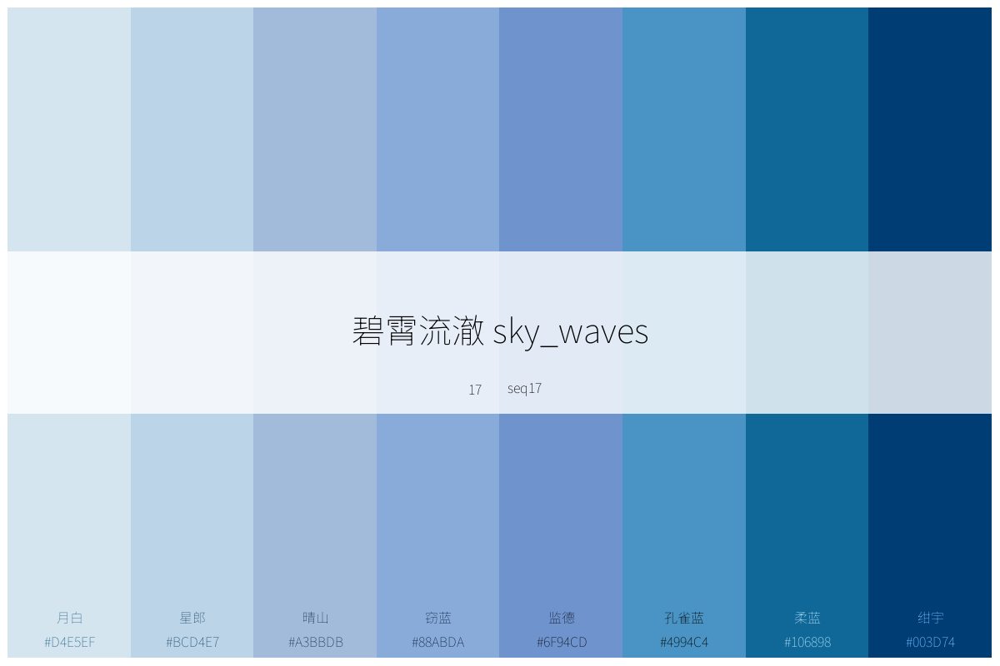
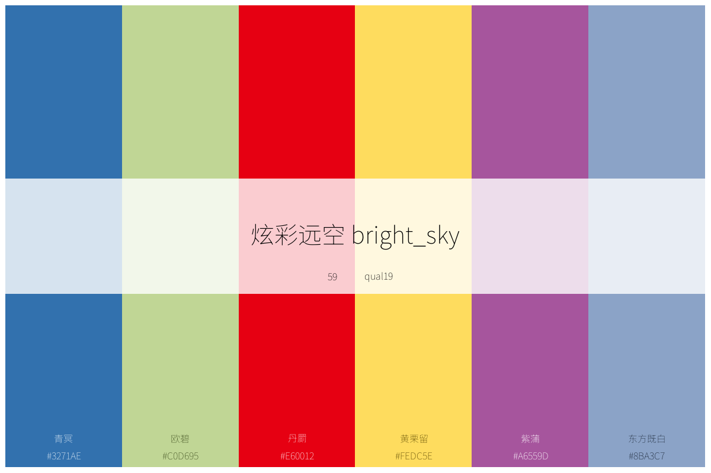
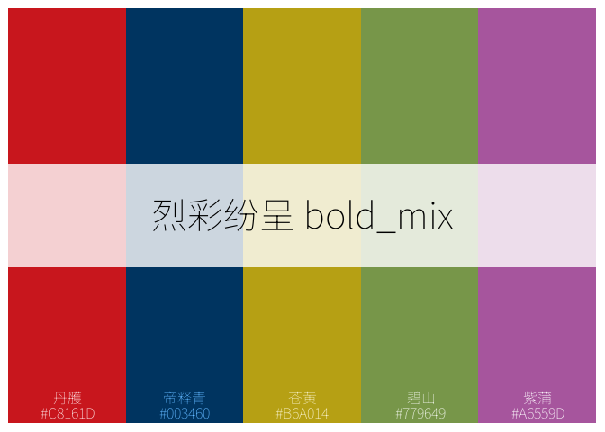
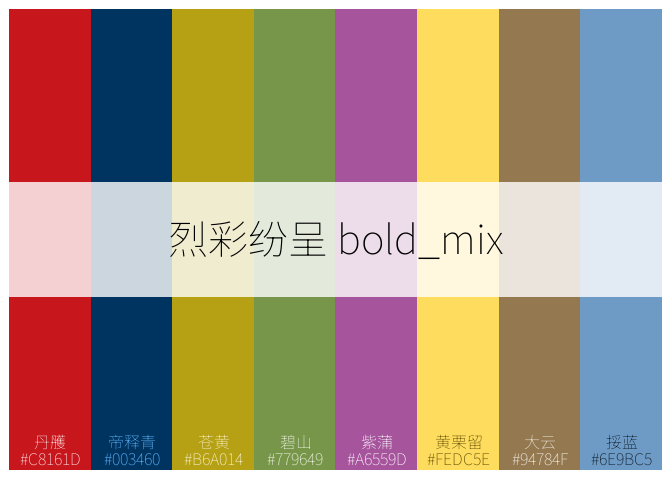
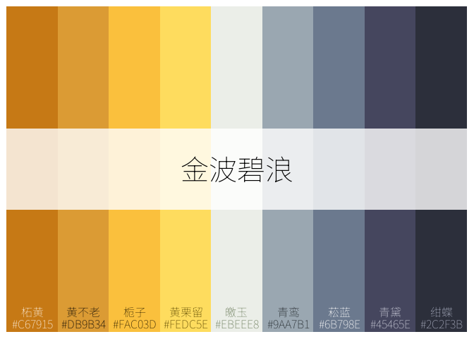
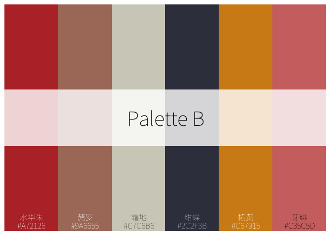
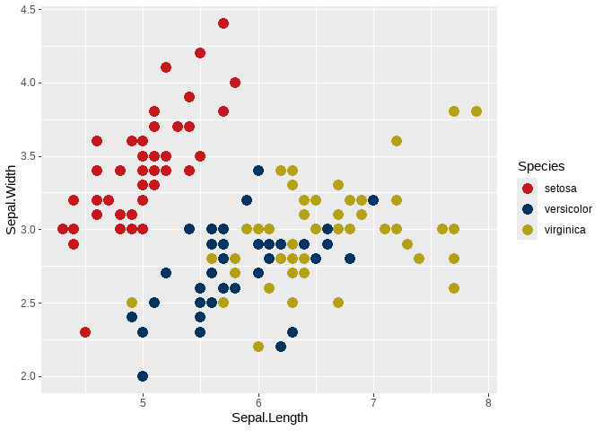
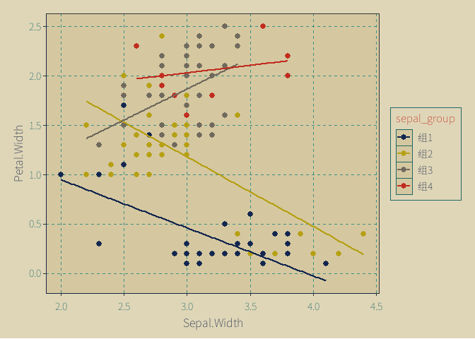
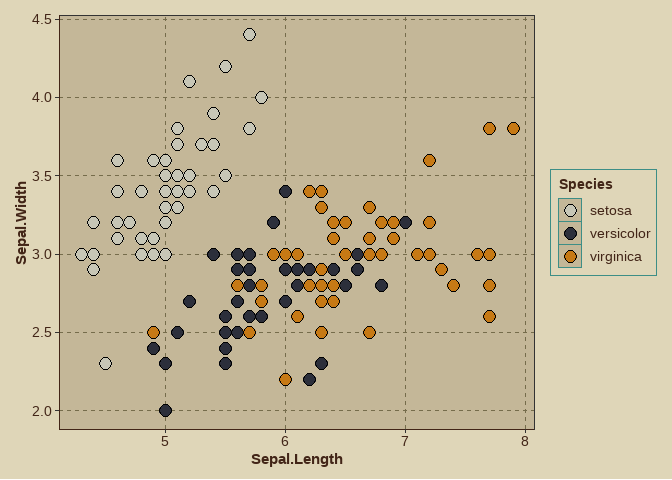

<!-- README.md is generated from README.Rmd. Please edit that file -->

| 语言 / Language | 版本 |
|-----------------|------|
| 🇨🇳 中文         | [README.zh-CN.md](README.zh-CN.md) |
| 🇺🇸 English      | [README.md](README.md) |

# chinacolor :中国传统色

<!-- badges: start -->
<!-- badges: end -->

受中文书籍[《中国传统色：故宫里的色彩美学》](https://baike.baidu.com/item/%E4%B8%AD%E5%9B%BD%E4%BC%A0%E7%BB%9F%E8%89%B2%EF%BC%9A%E6%95%85%E5%AE%AB%E9%87%8C%E7%9A%84%E8%89%B2%E5%BD%A9%E7%BE%8E%E5%AD%A6/56817070)的启发制作本包，将该书中384种颜色关键信息整理成颜色数据信息，基于这些数据：

- 内置了顺序型、发散性和定性型调色板各20个；

- 内置了5款基于中国传统文化特色的适配ggplot的绘图主题；

- 形成了浏览、打印这些颜色和调色板的函数，快速获取颜色和调色板信息；

- 形成了利用这些颜色或内置调色板定制调色板的工具；

- 形成了适配ggplot绘图的scales系列函数。

## 

<figure>

<figcaption
aria-hidden="true">带颜色分组编码的全部384种颜色</figcaption>
</figure>

<figure>

<figcaption aria-hidden="true">按节气分组的颜色</figcaption>
</figure>

<figure>

<figcaption aria-hidden="true">调色板示例</figcaption>
</figure>

## 安装

用如下方法安装本包开发版。

``` r
 # 用 devtools 安装
devtools::install_github("zhiming-chen/chinacolor")

# 或用 remotes 安装（语法相同）
remotes::install_github("zhiming-chen/chinacolor")
```

## 颜色:打印、预览与获取

### plot_color_grid 打印全部颜色

``` r
plot_color_grid(show_group = T)
```

可以在[colors_by_solar_term](https://github.com/zhiming-chen/chinacolor/tree/master/image/color/colors_by_solar_term)
中查看全部24个节气的颜色系列。

### list_colors 快速预览颜色

`list_colors`函数实现在Rstudio
中Viewer界面快速预览颜色，并即时获得颜色hex值，这个功能在我们设计调色板，或者绘图时调整颜色时提供帮助。

``` r
list_colors()
```


## 调色板：打印、预览、获取与定制

60组调色板被预置于本包中供调用。几个调色板示例：







内置的调色板被定义为三种类型，顺序型，发散型和定性型。每种20个。

这些调色板被id化以及规则命名化：

- 顺序型调色板：

  - id：1-20

  - 命名：seq01-seq20。

- 发散型调色板：

  - id：21-40

  - 命名：div01-div20。

- 定性型调色板：

  - id：41-60

  - 命名：qual01-qual20。

当然，每个调色板也有其中文名称与英文名称，通过输入对应名称，可获取单个调色板信息。

### list_palettes 预览调色板

和预览颜色一样，调色板也可以在Viewer界面进行预览。

``` r

list_palettes()
```


我们还可以通过这个函数将这些内置调色板信息导出。

``` r
palettes_info <- list_palettes()

head(palettes_info,10)
#>       Index ElementName ChineseName    EnglishName       Type Colors
#> seq01     1       seq01    樱霞晕彩   cherry_blush sequential      8
#> seq02     2       seq02    桃影轻霞     peach_glow sequential      7
#> seq03     3       seq03    紫韵花影   violet_bloom sequential      8
#> seq04     4       seq04    绯影红裳   scarlet_flow sequential      8
#> seq05     5       seq05    幽兰绀紫  mystic_purple sequential      7
#> seq06     6       seq06    曦光流金   golden_sheen sequential      5
#> seq07     7       seq07    焰霞飞舞     flame_glow sequential      6
#> seq08     8       seq08    金缕朝霞     amber_dawn sequential      8
#> seq09     9       seq09    翠微森语 forest_whisper sequential     10
#> seq10    10       seq10    琥珀流光     amber_glow sequential      7
```

### plot_palettes 打印多个调色板

`plot_palettes`
函数支持将多个调色板打印在一张图上，实现调色板的比较和选择。支持index和元素名称输入。

``` r
# 通过index值打印
plot_palettes(1:5)
```


``` r

# 通过元素名称打印
plot_palettes(c("seq01","div02","qual14","qual18"))
```


### plot_palette 打印单个调色板

这个函数打印内置的调色板，也支持打印自定义的调色板。默认模式为内置调色板。

当打印内置调色板时，支持index，元素名称，及调色板的中英文名称作为输入。

- 打印内置调色板

``` r
# 根据index打印
plot_palette(x = 43,show_text = T)
```


``` r
# 根据元素名称打印，并对调色板进行重命名

plot_palette(x = "div13",name = "ONLY FOR PROJECT A!!!")
```


``` r
# 根据调色板英文名打印，显示颜色信息

plot_palette(x = "scarlet_flow",show_text = T)
```


``` r

# 根据调色板中文名打印，显示颜色信息
plot_palette(x = "绯绿相生",show_text = T)
```


对于内置调色板，打印图形中间条形块内显示了关于调色板的四个信息，以帮助大家进行快速记忆与选择。底部可现实颜色hex值及其中文名称。出于显示效果考虑，函数将该参数设置为非默认显示。

- 打印自定义调色板

对于自定义调色板，输入可以是颜色向量或向量对象名称。

对于来自384种内置的颜色，支持显示中文名。

``` r
# 设置调色板名称
plot_palette(x = c("#99BCAC","#5F4321","#BA5140","#DD7694","#779649"),type = "custom",name = "Just for Test",show_text = T)
```


``` r

# 未设置调色板名称。不显示颜色信息
plot_palette(x = c("#99BCAC","#5F4321","#BA5140","#DD7694","#779649"),type = "custom")
```


``` r
# 输入向量名,调色板的名称将是向量名

test_pal <- c("#C67915","#2C2F3B","#9A6655","#A72126","#446A37","#5B3222")
plot_palette(x = test_pal,type = "custom",show_text = T)
```


### ctc_palette 定制调色板

`ctc_palette`
函数用于定制调色板，并被`scale_fill(color)_ctc_c/d/m`系列函数调用。

`type`参数默认为`built_in`,即内置调色板。

#### 从内置调色板提取、定制

和`plot_palette`
一样，palette_name\`参数支持index，元素名称，调色板中英文名称四种类型。

`n`
颜色数量，对于定性型调色板，不推荐设置的颜色数量大于调色板中颜色数量。

一些示例：

``` r
# index + 显示调色板，定义颜色数量及方向：颜色数量小于调色板数量，方向与调色板方向相反
ctc_palette(palette_name = 2,n = 5,direction = 1,show_colors = T)
#> Colors in the palette:
#> [1] "#F9D3E3" "#ECB0C1" "#F6BEC8" "#DD7694" "#B83570"
#> Number of colors: 5
```


    #> [1] "#F9D3E3" "#ECB0C1" "#F6BEC8" "#DD7694" "#B83570"
    # 元素名称, 定义颜色数量：颜色数量大于调色板数量，默认方向及调色板显示选项
    ctc_palette(palette_name = "seq02",n = 12,show_colors = T) 
    #> Colors in the palette:
    #>  [1] "#F9D3E3" "#F1BFD0" "#ECB1C1" "#F2B8C5" "#F1B0BE" "#E389A2" "#D2648A"
    #>  [8] "#BE4076" "#B1356C" "#A83666" "#9C375D" "#903754"
    #> Number of colors: 12


    #>  [1] "#F9D3E3" "#F1BFD0" "#ECB1C1" "#F2B8C5" "#F1B0BE" "#E389A2" "#D2648A"
    #>  [8] "#BE4076" "#B1356C" "#A83666" "#9C375D" "#903754"

``` r
## 发散型调色板的示例
ctc_palette(type = "built_in",palette_name = 22, n = 5, direction = 1,  show_colors = T)
#> Colors in the palette:
#> [1] "#E60012" "#EA5514" "#F5F3F2" "#EFEFEF" "#A2D2E2"
#> Number of colors: 5
```


    #> [1] "#E60012" "#EA5514" "#F5F3F2" "#EFEFEF" "#A2D2E2"
    ctc_palette(type = "built_in",palette_name = 22, n = 12, direction = - 1)
    #>  [1] "#003460" "#397B91" "#6DB0BC" "#9BCDDD" "#CBE1E9" "#F0EFEF" "#F3F2F1"
    #>  [8] "#F0AB8D" "#E94D13" "#E71712" "#DE0E17" "#D12920"

``` r
# 对于定性型调色板，颜色数量设置大于调色板颜色数量，会循环使用调色板中的颜色，不推荐使用。如无合适内置调色板，可自行定制。
ctc_palette(type = "built_in",palette_name = 44, n = 12,direction = 1,show_colors = T)
#> Colors in the palette:
#>  [1] "#C8161D" "#003460" "#B6A014" "#779649" "#A6559D" "#FEDC5E" "#94784F"
#>  [8] "#6E9BC5" "#C8161D" "#003460" "#B6A014" "#779649"
#> Number of colors: 12
```


    #>  [1] "#C8161D" "#003460" "#B6A014" "#779649" "#A6559D" "#FEDC5E" "#94784F"
    #>  [8] "#6E9BC5" "#C8161D" "#003460" "#B6A014" "#779649"

    ctc_palette(type = "built_in",palette_name = 44, n = 5,direction = 1,show_colors = T)
    #> Colors in the palette:
    #> [1] "#C8161D" "#003460" "#B6A014" "#779649" "#A6559D"
    #> Number of colors: 5



    #> [1] "#C8161D" "#003460" "#B6A014" "#779649" "#A6559D"
    ctc_palette(type = "built_in",palette_name = 44, direction = 1,show_colors = T)
    #> Colors in the palette:
    #> [1] "#C8161D" "#003460" "#B6A014" "#779649" "#A6559D" "#FEDC5E" "#94784F"
    #> [8] "#6E9BC5"
    #> Number of colors: 8



    #> [1] "#C8161D" "#003460" "#B6A014" "#779649" "#A6559D" "#FEDC5E" "#94784F"
    #> [8] "#6E9BC5"

#### 从内置颜色中选择颜色定制调色板

此种模式下，`palette_name`调色板名称和`n`颜色数量两个以及`direction`颜色方向等参数失效。

使用color_pick参数来选择颜色组别及子组序号和或颜色ID，也可以在这里输入颜色顺序要求等。

更方便的是使用`create_color_pick` 这个辅助函数，便捷的生成`抓色`list。

- 定制一个9个颜色构成的发散型调色板

``` r
 
color_pick_1 <- create_color_pick(groups = c(11,13,12),
                                  subgroups = list(4:1,1,1:4),
                                  order_rule =1)
 
Palette_C <- ctc_palette(type = "custom",
            color_pick =color_pick_1,
            show_colors = T,
            palette_title = "金波碧浪")
#> Colors in the palette:
#> [1] "#C67915" "#DB9B34" "#FAC03D" "#FEDC5E" "#EBEEE8" "#9AA7B1" "#6B798E"
#> [8] "#45465E" "#2C2F3B"
#> Number of colors: 9
```



``` r
Palette_C
#> [1] "#C67915" "#DB9B34" "#FAC03D" "#FEDC5E" "#EBEEE8" "#9AA7B1" "#6B798E"
#> [8] "#45465E" "#2C2F3B"
```

- 定制一个6个颜色构成的定性型调色板

``` r
color_pick_2 <- create_color_pick(groups = 10:15,
                                  subgroups = 3,
                                  order_rule =1)
color_pick_3 <- create_color_pick(groups = 10:15,
                                  subgroups = 4,
                                  order_rule =-1)

Palette_A <-  ctc_palette(type = "custom",
            color_pick =color_pick_2,
            show_colors = T,
            palette_title = "Palette A")
#> Colors in the palette:
#> [1] "#DC6B82" "#DB9B34" "#45465E" "#E0E0D0" "#B26D5D" "#C8161D"
#> Number of colors: 6
```


``` r
Palette_B <- ctc_palette(type = "custom",
            color_pick =color_pick_3,
            show_colors = T,
            palette_title = "Palette B")
#> Colors in the palette:
#> [1] "#A72126" "#9A6655" "#C7C6B6" "#2C2F3B" "#C67915" "#C35C5D"
#> Number of colors: 6
```



``` r
Palette_A 
#> [1] "#DC6B82" "#DB9B34" "#45465E" "#E0E0D0" "#B26D5D" "#C8161D"
Palette_B
#> [1] "#A72126" "#9A6655" "#C7C6B6" "#2C2F3B" "#C67915" "#C35C5D"
```

### 在ggplot里使用调色板

`ctc_palette`函数输出一组颜色hex值，这些输出可直接作为颜色的value用于ggplot绘图。

- 离散色 + 填充 场景

``` r
ggplot(data = iris,aes(x = Species,y = Petal.Length,fill = Species))+
    geom_violin()+
    scale_fill_manual(values = ctc_palette(palette_name = 48,n = 3))
```


或者直接使用已生成的定制调色板向量

``` r
ggplot(data = iris,aes(x = Species,y = Petal.Length,fill = Species))+
    geom_violin()+
    scale_fill_manual(values = Palette_A)
```


- 离散色 + 颜色 场景

选择内置定性型调色板

``` r
ggplot(data = iris,aes(x = Sepal.Length  ,y = Sepal.Width  ,color = Species))+
    geom_point(size = 4)+
    scale_color_manual(values = ctc_palette(palette_name = 44,n = 3))
```



- 连续色 + 颜色 场景

选择顺序型内置调色板

``` r
ggplot(data = iris,aes(x = Species,y = Sepal.Width,color = Sepal.Width))+
    geom_point(size = 4)+
    scale_color_gradientn(colours = ctc_palette(palette_name = 9))
```


- 连续色 + 填充 场景

本例使用前文中定制的发散型调色板向量。

``` r
 
df <- expand.grid(x = 1:20, y = 1:20)
df$z <- (df$x - 10) * (df$y - 10)   

ggplot(df, aes(x, y, fill = z)) +
  geom_tile(color = "white", size = 0.3) +   
  scale_fill_gradientn(
    colours = rev(Palette_C), # 进行反转，冷色代表负值，暖色代表正值。
    name = "Values",
  ) +
  labs(title = "Palette Test") +
  theme_minimal()
#> Warning: Using `size` aesthetic for lines was deprecated in ggplot2 3.4.0.
#> ℹ Please use `linewidth` instead.
#> This warning is displayed once every 8 hours.
#> Call `lifecycle::last_lifecycle_warnings()` to see where this warning was
#> generated.
```


## 适配ggplot绘图：scales 标度系列函数及theme主题模版

### 六组 scales 标度系列函数：

- scale_fill_ctc_d :离散色填充场景

- scale_color_ctc_d：离散色颜色场景

- scale_fill_ctc_c：连续色填充场景

- scale_color_ctc_c：连续色颜色场景

- scale_fill_ctc_m：定制色填充场景，只支持离散色场景

- scale_color_ctc_m：离散色颜色场景，只支持离散色场景

前四个函数支持将内置调色板作为输入，与`ctc_palette()`一样，支持四种输入调色板信息来获取内置调色板；

后两个支持将定制的调色板作为输入；可等价于ggplot包中`scale_fill(color)_m()`函数;同时支持color_pick
list，可由create_color_pick()函数生成，也可手动生成，属于384种颜色的专属定制色输入通道。

### 五组ggplot绘图的theme主题，基于中国传统文化元素制作，可供选用。

- theme_ctc_paper： 宣纸主题

- theme_ctc_dunhuang：敦煌主题

- theme_ctc_bronze：青铜器主题

- theme_ctc_mineral：大地主题

- theme_ctc_ink：水墨山水画主题

几个简单示例：

``` r
 iris$sepal_group <- cut(
     iris$Sepal.Length,
    breaks = 4,
   labels = paste0("组", 1:4)
 )
# 使用调色板index值 + 敦煌绘图主题
 ggplot(iris, aes(x = Sepal.Width,
                       y = Petal.Width,
                       color = sepal_group)) +
    geom_point(size = 2.5) +   
   geom_smooth(method = "lm", formula = y ~x, se = FALSE) +   
     scale_color_ctc_d(palette_name = 60)+   
    theme_ctc_dunhuang() 
```



``` r
 ggplot(mpg, aes(x = class, fill = class)) +
 geom_bar() +
 scale_fill_ctc_d(palette_name = 41)+
 theme_ctc_mineral()
```


``` r
# 使用调色板英文名称
 ggplot(mtcars, aes(x = wt, y = mpg, color = hp)) +
 geom_point(size = 4) +
 scale_colour_ctc_c(palette_name = "violet_bloom", direction = -1)+
    theme_ctc_paper(base_family = "sans")
```


``` r
 #使用调色板中文名称 + 古铜主题
ggplot(faithfuld, aes(x = eruptions, y = waiting, fill = density)) +
 geom_raster() +
 scale_fill_ctc_c(palette_name = "海天沙影", direction = 1, name = "Density")+
    theme_ctc_bronze(base_family = "sans")
```


``` r
 ggplot(iris, aes(Sepal.Length, Sepal.Width, fill = Species)) +
 geom_point(shape = 21, size = 3) +
 scale_fill_ctc_m(color_pick = color_pick_2) + ## 本例使用前文中已完成的pick_colorlist。
theme_ctc_dunhuang(base_family = "sans")
```


``` r
Pal_b <- Palette_B[3:5]
 
ggplot(iris, aes(Sepal.Length, Sepal.Width, fill = Species)) +
 geom_point(shape = 21, size = 4,stroke = 0.8) +
 scale_fill_ctc_m(palette = Pal_b) + ## 支持输入颜色向量，此时等同于scale_fill_manual 函数
 theme_ctc_bronze(base_family = "sans",oxidation_level = "light")
```



``` r
  
  my_pick <- create_color_pick(
   color_id = c(124, 324, 44),  
  order_rule = -1            
  )
 
  
 ggplot(mtcars, aes(mpg, wt, color = factor(cyl))) +
 geom_point(size = 4) +
  scale_colour_ctc_m(color_pick = my_pick) +  
 theme_ctc_mineral(base_family = "sans",base_size = 14)
```


## Issues

可以通过https://github.com/zhiming-chen/chinacolor/issues
提交问题，反馈bug.

也欢迎大家贡献配色方案及改进优化意见.

公众号，知乎： 空行马天君； QQ邮箱：<25172952@qq.com>
