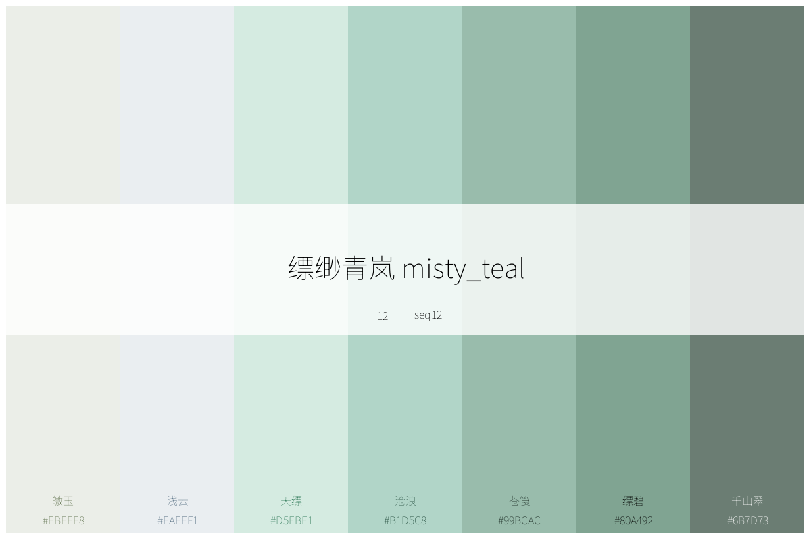
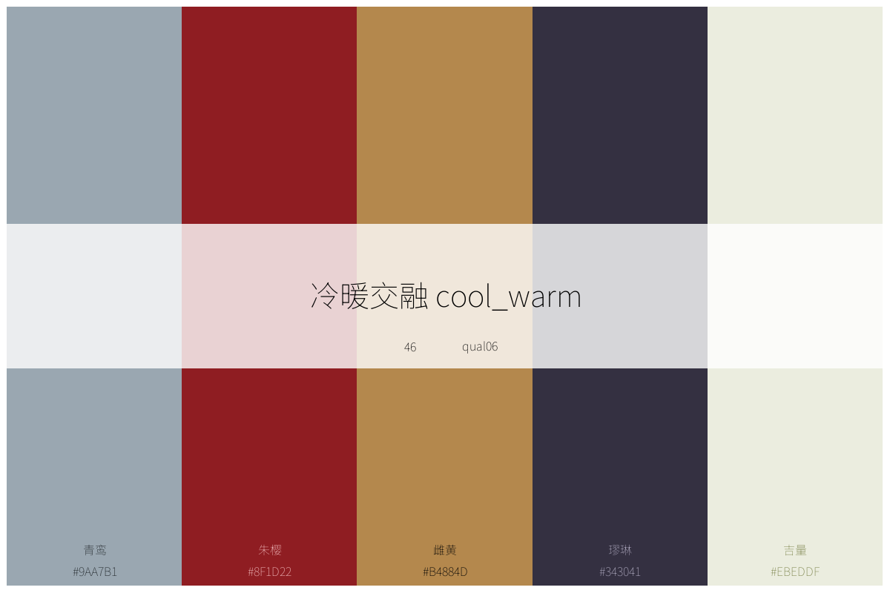
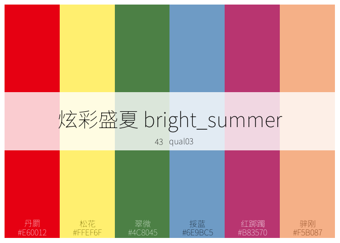
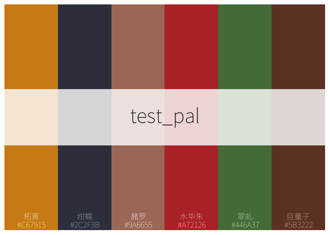
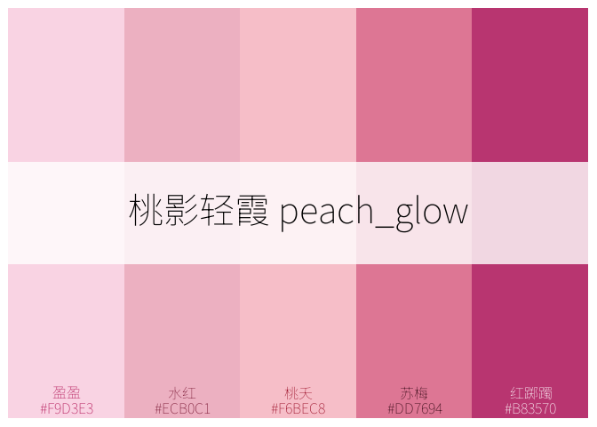
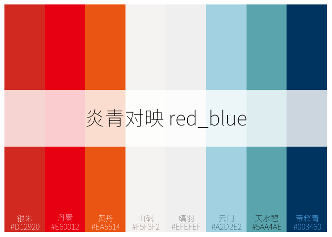
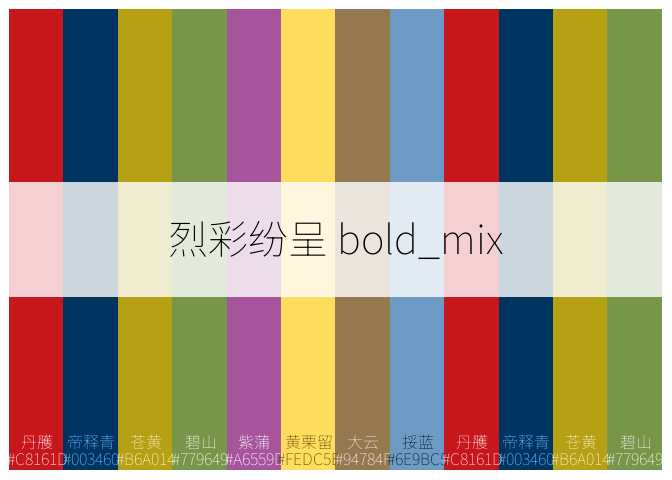
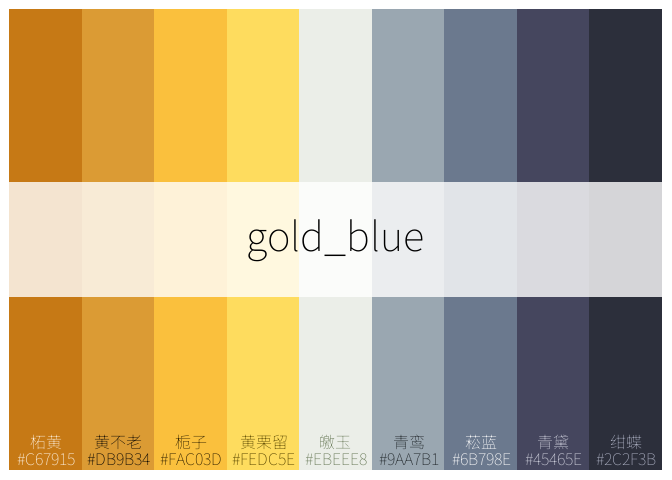

<!-- README.md is generated from README.Rmd. Please edit that file -->

# chinacolor

<!-- badges: start -->
<!-- badges: end -->

这个包受中文书籍[《中国传统色：故宫里的色彩美学》](https://baike.baidu.com/item/%E4%B8%AD%E5%9B%BD%E4%BC%A0%E7%BB%9F%E8%89%B2%EF%BC%9A%E6%95%85%E5%AE%AB%E9%87%8C%E7%9A%84%E8%89%B2%E5%BD%A9%E7%BE%8E%E5%AD%A6/56817070)的启发而制作，将该书提及到的384种颜色关键信息整理成颜色数据信息，基于这些数据：

- 内置了顺序型、发散性和定性型调色板各20个；

- 内置了5款基于中国传统文化特色的适配ggplot的绘图主题；

- 形成了浏览、打印这些颜色和调色板的函数，供用户快速获取颜色信息；

- 形成了利用这些颜色或内置调色板定制调色板的工具；

- 形成了适配ggplot绘图的scales系列函数。

一千个人眼中有一千个哈姆雷特。384种颜色，更能绘制出万千精彩。这里不想赘述中华传统色出彩的视觉感受和入化的神韵和内涵。毕竟，美，往往是不可言，也无需多言的。

期望这个包能帮助到大家，促发灵感、增进兴趣。或者，让大家的交付和世界，稍微更优美一些…

## 

<figure>

<figcaption aria-hidden="true">调色板示例</figcaption>
</figure>

<figure>

<figcaption aria-hidden="true">季节示例</figcaption>
</figure>

## Installation

You can install the development version of `chinacolor` like so:

``` r
 # 用 devtools 安装
devtools::install_github("zhiming-chen/chinacolor")

# 或用 remotes 安装（语法相同）
remotes::install_github("zhiming-chen/chinacolor")
```

## 颜色:打印、预览与获取

### plot_color_grid 打印全部颜色

384种颜色，按中国24个节气排列。每个节气分四组，每组4个颜色共16个颜色。下图供大家预览这384种颜色：

<figure>

<figcaption aria-hidden="true">384种颜色</figcaption>
</figure>

也可以执行`plot_color_grid`
函数查看,设置`show_group`参数可以控制是否显示颜色分组。

``` r
plot_color_grid(show_group = T)
```

目前，尚无函数来支持打印按季节显示颜色的图形，不过，我们可以在XXXXXX(github
仓库地址)查看全部24个节气的颜色系列。这些图形中包含丰富的颜色信息，包括颜色id(这些id
在本包中方便我们设计调色板时取色)，RGB值，CMYK值，当然，也有HEX值。每个颜色有一个中文名，对于熟悉中文或者对中文感兴趣的人，这也是一种不错的体验。

### list_colors 快速预览颜色

很多时候，我们需要即时、动态、快速预览并获得颜色，`list_colors`函数，我觉得是一个非常amazing的函数，能帮助我们在Rstudio
中Viewer界面快速预览颜色，并即时获得颜色hex值，总之，我已经非常迷恋这个函数，甚至有点离不开他了。

``` r
list_colors()
```

是的，你只需在console
里键入`list_colors()`,在Viewer界面就能显示颜色，默认16行一页…

忍不住多说几句，这个功能在我们设计调色板，或者绘图时调整颜色时真的非常有帮助。

## 调色板：打印、预览、获取与定制

现在，我们对这384种颜色已经有一定了解了，不得不说，这些颜色，那是相当的amazing。如我们所见，这些颜色分组，本身已经是一种调色板的设置，至少是形成了一些我们可用的初始形态了。60组调色板被预置于本包中，供使用本包时调用，后续也许还会更新一些有趣的调色板。当然，你也可以基于这些颜色设计属于自己的调色板。

关于调色板的打印、预览、获取与定制，下面这些函数被设计用来尽可能的方便大家。

我们可以先感受一下这些调色板：








内置的调色板被定义为三种类型，顺序型，发散型和定性型。每种20个。

这些调色板被id化以及规则命名化：

- 顺序型调色板：

  - id：1-20

  - 命名：seq01-seq20。

- 发散型调色板：

  - id：21-40

  - 命名：div01-div20。

- 定性型调色板：

  - id：41-60

  - 命名：qual01-qual20。

当然，每个调色板也有其中文名称与英文名称，通过输入对应名称，可获取单个调色板信息。

### list_palettes 预览调色板

和预览原色一样，调色板也是可以在Viewer界面进行预览的，这能解决我们对调色板中文名或英文名不熟悉的问题(我在使用其他一些经典的配色包时，经常碰到这样的问题，记住名字对我来讲通常是很困难的事情),也能第一时间预览到调色板颜色状态，这对在scale
系列函数中使用调色板，以及通过`ctc_palette`函数自定义调色板都是很有帮助的。

`list_palettes()` 函数轻松解决这一问题。

``` r

list_palettes()
```

我们还可以通过这个函数将这些内置调色板信息导出。

``` r
palettes_info <- list_palettes()

palettes_info
#>        Index ElementName ChineseName    EnglishName        Type Colors
#> seq01      1       seq01    樱霞晕彩   cherry_blush  sequential      8
#> seq02      2       seq02    桃影轻霞     peach_glow  sequential      7
#> seq03      3       seq03    紫韵花影   violet_bloom  sequential      8
#> seq04      4       seq04    绯影红裳   scarlet_flow  sequential      8
#> seq05      5       seq05    幽兰绀紫  mystic_purple  sequential      7
#> seq06      6       seq06    曦光流金   golden_sheen  sequential      5
#> seq07      7       seq07    焰霞飞舞     flame_glow  sequential      6
#> seq08      8       seq08    金缕朝霞     amber_dawn  sequential      8
#> seq09      9       seq09    翠微森语 forest_whisper  sequential     10
#> seq10     10       seq10    琥珀流光     amber_glow  sequential      7
#> seq11     11       seq11    柔沙古调      soft_sand  sequential      7
#> seq12     12       seq12    缥缈青岚     misty_teal  sequential      7
#> seq13     13       seq13    翠隐山庭    jade_garden  sequential      9
#> seq14     14       seq14    苍林碧落 emerald_forest  sequential      9
#> seq15     15       seq15    晴岚碧水     clear_lake  sequential      7
#> seq16     16       seq16    云碧深渊     aqua_depth  sequential      7
#> seq17     17       seq17    碧霄流澈      sky_waves  sequential      8
#> seq18     18       seq18    深海黛影    deep_indigo  sequential      8
#> seq19     19       seq19    古陶温光      clay_glow  sequential      8
#> seq20     20       seq20    山翠沉墨     forest_ink  sequential      8
#> div01     21       div01    朱翠交辉      red_green   diverging      8
#> div02     22       div02    炎青对映       red_blue   diverging      8
#> div03     23       div03    绯绿相生   pink_emerald   diverging      7
#> div04     24       div04    焰阳流金     flame_gold   diverging      7
#> div05     25       div05    暮烟紫岚    dusk_violet   diverging      8
#> div06     26       div06    烟翠古韵    smoke_green   diverging      8
#> div07     27       div07    樱紫幻梦   cherry_dream   diverging      9
#> div08     28       div08    青翠生辉    fresh_green   diverging      8
#> div09     29       div09    青翠田野    field_green   diverging      8
#> div10     30       div10    晨曦海岸     dawn_coast   diverging      8
#> div11     31       div11    秋林暖阳     autumn_sun   diverging      8
#> div12     32       div12    林火秋晖   forest_flame   diverging      9
#> div13     33       div13    绿砂炽焰    green_flare   diverging      7
#> div14     34       div14    森影深红     forest_red   diverging      8
#> div15     35       div15    秋水青岚    autumn_blue   diverging      7
#> div16     36       div16    黛影流沙       ink_sand   diverging      7
#> div17     37       div17    海天沙影       sea_sand   diverging      9
#> div18     38       div18    黛海玫瑰     ocean_rose   diverging     10
#> div19     39       div19    碧空炽阳      sky_flare   diverging     10
#> div20     40       div20    碧紫流金      blue_gold   diverging      9
#> qual01    41      qual01    炽彩律动     vivid_move qualitative      7
#> qual02    42      qual02    沉稳古韵   deep_classic qualitative      6
#> qual03    43      qual03    炫彩盛夏  bright_summer qualitative      6
#> qual04    44      qual04    烈彩纷呈       bold_mix qualitative      8
#> qual05    45      qual05    柔彩暖夏    soft_summer qualitative      6
#> qual06    46      qual06    冷暖交融      cool_warm qualitative      5
#> qual07    47      qual07    柔绿粉蓝    soft_pastel qualitative      4
#> qual08    48      qual08    花园晨曲    garden_song qualitative      6
#> qual09    49      qual09    金夜之境     gold_night qualitative      6
#> qual10    50      qual10    春日花语 spring_blossom qualitative      7
#> qual11    51      qual11    晨露花园     dew_garden qualitative      7
#> qual12    52      qual12    明丽初夏  bright_summer qualitative      7
#> qual13    53      qual13    炫动花火     fire_bloom qualitative      8
#> qual14    54      qual14    晨光和风 morning_breeze qualitative      7
#> qual15    55      qual15    花园晨曦    garden_dawn qualitative      8
#> qual16    56      qual16    秋暮深调    autumn_deep qualitative      7
#> qual17    57      qual17    静谧行旅   calm_journey qualitative      7
#> qual18    58      qual18    云霞远影     cloud_haze qualitative      6
#> qual19    59      qual19    炫彩远空     bright_sky qualitative      6
#> qual20    60      qual20    夜金深影     night_gold qualitative      6
```

### plot_palettes 打印多个调色板

`plot_palettes`
函数支持将多个调色板打印在一张图上，支持index和元素名称输入。

``` r
# input index
plot_palettes(1:5)
```


``` r

# input element names
plot_palettes(c("seq01","div02","qual14","qual18"))
```


他能帮助我们将多个调色板颜色信息置于一处以便选择比较。

### plot_palette 打印单个调色板

当我们想查看单个调色板细节时，`plot_palette` 函数就能派上用场。

这个函数打印内置的调色板，也支持打印自定义的调色板。默认模式为内置调色板。

当打印内置调色板时，支持index，elementname,以及调色板的中英文名称作为输入。同时也支持显示颜色hex值和名称等功能，对于调色板名称需要自定义，如在绘制图形时，需要备注不同调色板用于不同产品或者客户时，可以通过名称来进行备注。

- 打印内置调色板

``` r
# input index
plot_palette(x = 43,show_text = T)
```



``` r
# input elementname, no color text show,and defined palette name 

plot_palette(x = "div13",name = "ONLY FOR PROJECT A!!!")
```


``` r
# palette_name in Chinese or English 

plot_palette(x = "scarlet_flow",show_text = T)
```


``` r
plot_palette(x = "绯绿相生",show_text = T)
```


对于内置调色板，打印图形中间条形块内显示了关于调色板的四个信息，以帮助大家进行快速记忆与选择。底部可现实颜色hex值及其中文名称。出于显示效果考虑，函数将该参数设置为非默认显示。

- 打印自定义调色板

对于自定义调色板，输入可以是颜色向量或向量对象名称。该功能更多的是为自定义调色板时调色板的显示而生。这里简单示例。

对于自定义调色板,关于名称显示，如输入了名称，以输入的名称为准。如未输入名称，当输入为颜色向量时，调色板名称显示为`unnamed palette`，当输入为颜色向量对象名时，调色板名称显示为向量名。

对于来自384种内置的颜色，其中文名是可以显示的。仅支持全部来着内置颜色的显示。

``` r
# name provided
plot_palette(x = c("#99BCAC","#5F4321","#BA5140","#DD7694","#779649"),type = "custom",name = "Just for Test",show_text = T)
```


``` r
# no name provided and show_text in default status
plot_palette(x = c("#99BCAC","#5F4321","#BA5140","#DD7694","#779649"),type = "custom")
```


``` r
# 输入向量名

test_pal <- c("#C67915","#2C2F3B","#9A6655","#A72126","#446A37","#5B3222")
plot_palette(x = test_pal,type = "custom",show_text = T)
```



这两个调色板看起来不错，值得收藏起来。

### ctc_palette 定制调色板

`ctc_palette` 函数用于定制调色板，并被scale_fill(color)*ctc*\*
系列函数调用。

ctc为Chinese Traditional Colors 三个单词的首字母组合。他能实现：

- 从内置的调色板里获取颜色信息，并执行颜色数量，方向等基础编辑；

- 也支持从内置的384种颜色中，按id,group,subgroup以及他们的组合拾取颜色形成自定义调色板。因为原书作者对颜色的理解非常专业，该函数使用了颜色分组和子组的选择。(我用子组对这些颜色在其所在颜色分组里进行了简单的数字定义，在原书中，每个子组均有其内在含义的，这里不展开)

#### 从内置调色板提取、定制

可通过调色板名称，颜色数量，颜色方向等参数来从内置调色板中定制属于自己的调色板。此时，color_pick
参数是不生效的。

- `palette_name` 参数:
  可输入index(1-60)，elementname(seq01,div13,qual18等调色板在调色板list中的元素名),以及调色板的中英文名。这和`plot_palette`函数是一致的。

- `n`颜色数量参数，可自定义颜色数量。默认值为调色板颜色数量。输入的数量大于或小于调色板颜色数量均可。

  1.  输入的颜色数量`n`大于调色板颜色数量(强烈建议不出现此情形)：

  - 对于顺序型调色板和发散型调色板，颜色会被等距计算并均匀分布成目标数量的颜色，但`show_colors`参数不能为`TRUE`(这应该是一个bug,后续升级时会进行优化)；
  - 对于定性型调色板，调色板的颜色会被自动补位，亦即不会新增颜色。这种调色板用于实际场景是容易出现视觉效果异常甚至错误的。

  2.  输入的颜色数量`n`小于调色板颜色数量(强烈建议不出现此情形)：

  - 对于顺序型调色板和定性型调色板，颜色会按当前顺序，从`1`到`n`选择；
  - 对于发散型调色板,颜色会从中间色依次向两端选择，直到`n`个颜色被选择。

- `direction` 颜色方向参数：用来设置颜色方向，默认与调色板颜色方向一致。

一些示例：

``` r
ctc_palette(type = "built_in",palette_name = 2,n = 5,direction = 1,show_colors = T)
#> Colors in the palette:
#> [1] "#F9D3E3" "#ECB0C1" "#F6BEC8" "#DD7694" "#B83570"
#> Number of colors: 5
```



    #> [1] "#F9D3E3" "#ECB0C1" "#F6BEC8" "#DD7694" "#B83570"
    ctc_palette(type = "built_in",palette_name = 2,direction = -1,show_colors = T)
    #> Colors in the palette:
    #> [1] "#903754" "#A73766" "#B83570" "#DD7694" "#F6BEC8" "#ECB0C1" "#F9D3E3"
    #> Number of colors: 7


    #> [1] "#903754" "#A73766" "#B83570" "#DD7694" "#F6BEC8" "#ECB0C1" "#F9D3E3"
    ctc_palette(type = "built_in",palette_name = 2,n = 12) 
    #>  [1] "#F9D3E3" "#F1BFD0" "#ECB1C1" "#F2B8C5" "#F1B0BE" "#E389A2" "#D2648A"
    #>  [8] "#BE4076" "#B1356C" "#A83666" "#9C375D" "#903754"

``` r
ctc_palette(type = "built_in",palette_name = 22, n = 12,direction = 1,show_colors = F)
#>  [1] "#D12920" "#DE0E17" "#E71712" "#E94D13" "#F0AB8D" "#F3F2F1" "#F0EFEF"
#>  [8] "#CBE1E9" "#9BCDDD" "#6DB0BC" "#397B91" "#003460"
ctc_palette(type = "built_in",palette_name = 22, n = 5,direction = 1,show_colors = T)
#> Colors in the palette:
#> [1] "#E60012" "#EA5514" "#F5F3F2" "#EFEFEF" "#A2D2E2"
#> Number of colors: 5
```


    #> [1] "#E60012" "#EA5514" "#F5F3F2" "#EFEFEF" "#A2D2E2"
    ctc_palette(type = "built_in",palette_name = 22, direction = 1,show_colors = T)
    #> Colors in the palette:
    #> [1] "#D12920" "#E60012" "#EA5514" "#F5F3F2" "#EFEFEF" "#A2D2E2" "#5AA4AE"
    #> [8] "#003460"
    #> Number of colors: 8



    #> [1] "#D12920" "#E60012" "#EA5514" "#F5F3F2" "#EFEFEF" "#A2D2E2" "#5AA4AE"
    #> [8] "#003460"

``` r
# 对于定性型调色板，颜色数量不宜超过调色板数量，如无合适内置调色板，可自行定制。
ctc_palette(type = "built_in",palette_name = 44, n = 12,direction = 1,show_colors = T)
#> Colors in the palette:
#>  [1] "#C8161D" "#003460" "#B6A014" "#779649" "#A6559D" "#FEDC5E" "#94784F"
#>  [8] "#6E9BC5" "#C8161D" "#003460" "#B6A014" "#779649"
#> Number of colors: 12
```



    #>  [1] "#C8161D" "#003460" "#B6A014" "#779649" "#A6559D" "#FEDC5E" "#94784F"
    #>  [8] "#6E9BC5" "#C8161D" "#003460" "#B6A014" "#779649"

    ctc_palette(type = "built_in",palette_name = 44, n = 5,direction = 1,show_colors = T)
    #> Colors in the palette:
    #> [1] "#C8161D" "#003460" "#B6A014" "#779649" "#A6559D"
    #> Number of colors: 5


    #> [1] "#C8161D" "#003460" "#B6A014" "#779649" "#A6559D"
    ctc_palette(type = "built_in",palette_name = 44, direction = 1,show_colors = T)
    #> Colors in the palette:
    #> [1] "#C8161D" "#003460" "#B6A014" "#779649" "#A6559D" "#FEDC5E" "#94784F"
    #> [8] "#6E9BC5"
    #> Number of colors: 8


    #> [1] "#C8161D" "#003460" "#B6A014" "#779649" "#A6559D" "#FEDC5E" "#94784F"
    #> [8] "#6E9BC5"

#### 从内置颜色中选择颜色定制调色板

很多时候，我们需要，或者希望定制自己的调色板，或者需要动态调整参数，抑或，内置的调色板不能满足实际需求，比如定性型调色板数量不够，这时候，自行定制是一个不错的选择。

鉴于384种颜色以及其已设计好的分组及子组模式，我们能够非常方便的从中抓取颜色来形成自己的调色板，可能对于顺序型调色板会比较困难些，但对于生成定性型或者类发散性调色板，会是非常轻松的事情。

此种模式下，`palette_name`调色板名称和`n`颜色数量两个以及`direction`颜色方向等参数失效。

使用color_pick参数来选择颜色组别及子组序号和或颜色ID，也可以在这里输入颜色顺序要求等。

当然更方便的是使用`create_color_pick`
这个辅助函数，便捷的生成`抓色`list。

这个函数实现了抓取颜色的高灵活性：

这看起来会有点复杂，主要是我们支持了颜色分组与子组的灵活配置与选择，尤其是子组的选择方面。
对于颜色组别(1-96)，只支持输入数值向量，比如group =
c(4,8,12,16,20),定义了颜色从这5个组别里选择；
subgroup可以非常灵活，比如：subgroup = 3，代表取上述5组颜色的第三个；sub
=
1:4,代表前四个组分别选择第1,2,3,4个颜色，第五组选择全部颜色(子组为空时默认全部)，当然也可以通过list来分别指定每个组抓取具体位置的颜色…

- 定制一个9个颜色构成的发散型调色板

``` r
 
color_pick_1 <- create_color_pick(groups = c(11,13,12),
                                  subgroups = list(4:1,1,1:4),
                                  order_rule =1)
 
ctc_palette(type = "custom",
            color_pick =color_pick_1,
            show_colors = T,
            palette_title = "金波碧浪")
#> Colors in the palette:
#> [1] "#C67915" "#DB9B34" "#FAC03D" "#FEDC5E" "#EBEEE8" "#9AA7B1" "#6B798E"
#> [8] "#45465E" "#2C2F3B"
#> Number of colors: 9
```



    #> [1] "#C67915" "#DB9B34" "#FAC03D" "#FEDC5E" "#EBEEE8" "#9AA7B1" "#6B798E"
    #> [8] "#45465E" "#2C2F3B"

这个例子中，从第11组取其全部四种颜色，顺序反过来(subgroup
顺序为4,3,2,1),从第12组中取其全部四种颜色，依次获取即可，再取第13组颜色中的第一个颜色，以此顺序即可获得上述调色板。这组颜色像是日落前，在邮轮甲板上日落方向的铺满金黄色，慢慢进展到身下的水面白色波浪翻滚，转过身去，背阳面向远处逐渐阴冷暗淡的那种调调…

- 定制一个6个颜色构成的定性型调色板

这会是非常easy的事情，前提是你对颜色比较熟悉，可以使用`list_colors()`在Viewer界面里即时浏览颜色。subgroup值与颜色的明度与和饱和度相关。通俗的讲，想要深一点的颜色，subgroup值可以选3,4,否则选1,2.如下示例中，我用一个非常简单的方法获得两组调色板。

``` r
color_pick_2 <- create_color_pick(groups = 10:15,
                                  subgroups = 3,
                                  order_rule =1)
color_pick_3 <- create_color_pick(groups = 10:15,
                                  subgroups = 4,
                                  order_rule =-1)

ctc_palette(type = "custom",
            color_pick =color_pick_2,
            show_colors = T,
            palette_title = "Palette A")
#> Colors in the palette:
#> [1] "#DC6B82" "#DB9B34" "#45465E" "#E0E0D0" "#B26D5D" "#C8161D"
#> Number of colors: 6
```


    #> [1] "#DC6B82" "#DB9B34" "#45465E" "#E0E0D0" "#B26D5D" "#C8161D"
    ctc_palette(type = "custom",
                color_pick =color_pick_3,
                show_colors = T,
                palette_title = "Palette B")
    #> Colors in the palette:
    #> [1] "#A72126" "#9A6655" "#C7C6B6" "#2C2F3B" "#C67915" "#C35C5D"
    #> Number of colors: 6


    #> [1] "#A72126" "#9A6655" "#C7C6B6" "#2C2F3B" "#C67915" "#C35C5D"

当然，在color_pick里也可以直接输入颜色id,这是最常规的操作，示例从略。

到目前为止，我们已熟悉内置颜色和调色板的打印与浏览，能够选择或提取内置的调色板，同时也实现了基于内置颜色的调色板定制。

接下来就是一些简单的使用介绍示例。

### 在ggplot里使用调色板

## scales 标度系列函数，适配ggplot绘图

## theme模版，源于中国传统文化

``` r

list_colors()
```

``` r
summary(cars)
#>      speed           dist       
#>  Min.   : 4.0   Min.   :  2.00  
#>  1st Qu.:12.0   1st Qu.: 26.00  
#>  Median :15.0   Median : 36.00  
#>  Mean   :15.4   Mean   : 42.98  
#>  3rd Qu.:19.0   3rd Qu.: 56.00  
#>  Max.   :25.0   Max.   :120.00
```

You’ll still need to render `README.Rmd` regularly, to keep `README.md`
up-to-date. `devtools::build_readme()` is handy for this.

You can also embed plots, for example:


In that case, don’t forget to commit and push the resulting figure
files, so they display on GitHub and CRAN.
